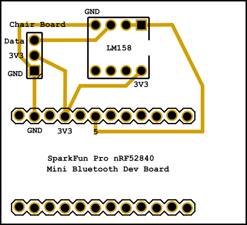

# Occupancy Sensor
Code for chair sensor tracking sedentary state of user and passing bluetooth data to a central computer system.

## Hardware
All the various parts of note and assembly info

### BOM
 - Seat sensor pad [Link](https://www.amazon.com/Replacement-Chair-Sensor-Smart-Caregiver/dp/B01N0P2J6X)
 - Seat sensor alarm box (comes with a pad) [Link](https://www.amazon.com/Basic-Fall-Monitor-Chair-Warranty/dp/B0099XN3ZS/)
 - Bluetooth module [Link](https://www.sparkfun.com/products/15025)
 - LM158J dual opamp [Link](https://www.digikey.com/en/products/detail/texas-instruments/LM158J/148995)
 - 3.2" x 2.0" (81mm x 51mm), 0.063" thick Protoboard [Link](https://www.adafruit.com/product/571)
 - DTP 605068 3.7V 2000 mAh LiIon Battery [Link](https://www.sparkfun.com/products/13855)
 - 3D Printed Case
 - M2 screws x4
 - Seat cover
 - Some sort of control PC
 - Break away headers male [Link](https://www.sparkfun.com/products/116)
 - Female headers [Link](https://www.sparkfun.com/products/115)

### Circuit Schematic

Chair sensor lines go to the off the shelf board from hell.

### Packaging Files

### Assembly

## Software
All the info for the onboard firmware and packet transfer protocol. Does not include the PC side software.

### Dependencies
The system dependencies and versions are listed here with links. Additionally, the specific packages are held local to this folder structure for archival as well.

 - Arduino IDE, compiled and uploaded with version 1.8.19 on Windows 10
 - Adafruit nRF52 version 0.9.3 [Link](https://github.com/adafruit/Adafruit_nRF52_Arduino)

### Setup, Compiling, & Upload

 1. Install Arduino IDE
 2. Add https://raw.githubusercontent.com/adafruit/arduino-board-index/gh-pages/package_adafruit_index.json to Preferences > Additional Board Managers
 3. Open Tools > Board Managers
 4. Search on "nRF" and install Adafruit nRF52 version 0.9.3
 5. Select the Adafruit Blufruit nRF52840DK PCA10056 board

### Bluetooth Packet Protocol

IDK, we do some nonsense and get a 0 or 1 on the pc side, corresponding to sitting/not sitting (which is which??? idk)

